# Redesigning Forth: comptime register stack on Arm64; optimization tricks; color-Forth in ASCII

This talk has two unrelated topics:

- Directly mapping stack-style programming to register-addressing architectures such as Arm64, WITHOUT a smart compiler.
- Syntax overhaul: make Forth colorful and clear with ZERO changes to compiler or execution mode.

All illustrations are bot-generated.



## Intro

About me: https://mitranim.com.

Astil Forth repository: https://github.com/mitranim/astil_forth.

Target audience:
- Compiler amateurs in general.
- Folks interested in a fast Forth on Apple Silicon.
- Folks interested in optimizing Forth for register-addressing CPUs (x64, Arm64, RISC-V and so on), with minimal complexity.

I gave talks about this system in prior SVFIG meetings:

- 2026-Jan: intro, self-assembly showcase, demos — https://www.youtube.com/watch?v=_4U1BR1U_oM
- 2026-Feb: register stack basics; transparent ABI interop — https://www.youtube.com/watch?v=rCF7wAB2wFQ
- 2026-Apr: turning JIT compilation into AOT compilation — https://www.youtube.com/watch?v=vkJJhURJt78

In particular, see my Feb talk about direct register allocation, where I claimed how many limitations this imposes on the language. Today is an extension of that talk. We unravel some of those limitations, and restore stack-style concatenative code, without giving up direct reg-alloc or codegen quality.


## Quick recap of Astil Forth

- Redesign on top of **core** Forth ideas.
- Current target: Arm64 + MacOS.
- Rejects stack acrobatics.
- Directly uses numbered registers as "stack".
- Directly interops with libc and other foreign code.
- C-style codegen and similar-enough performance. See `bench/readme.md`.
- AOT compilation via program snapshot.
- On-the-fly self-bootstrap.
- On-the-fly self-assembly.
- Small-ish compiler and language core: a few thousand LoC.


## Comparison with Green Arrays

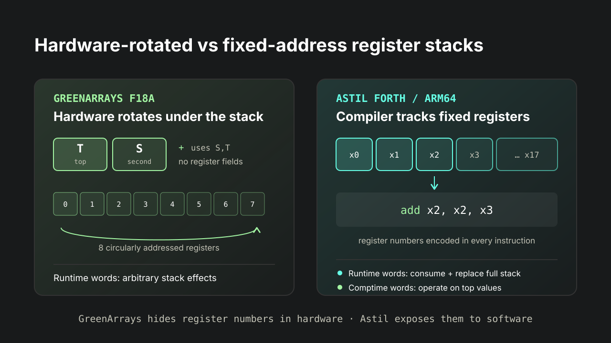

Green Arrays stack:
- 2 top registers + 8 rotating registers.
- No register addressing inside instructions.
- Simpler compilation.
- Runtime words have arbitrary stack effects.

Astil Forth stack:
- 18 fixed-address Arm64 registers.
- Individually addressed inside instructions.
- More complex compilation.
- Runtime words consume and replace entire stack.
- Comptime words can operate on top values.
- More comptime words needed.
- Transparent interop with `libc` and other foreign code.

However:
- Still simple enough.
- Still single-pass assembly (with fixups).


## How it works

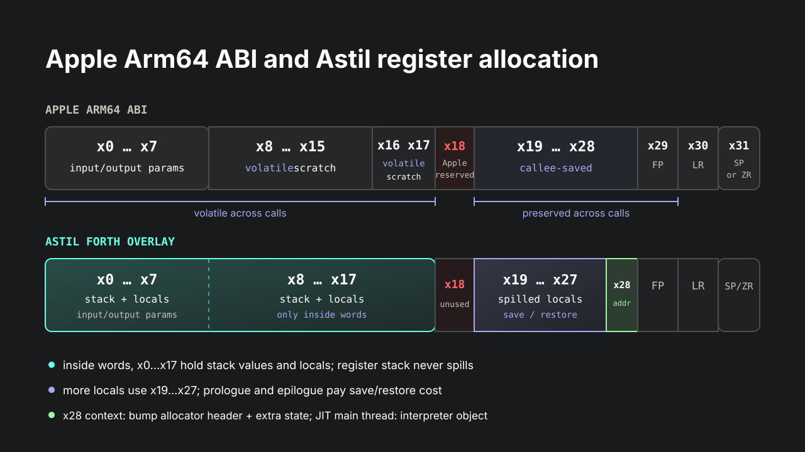

Arm64 general-purpose registers:
- `x0 … x7`   — input-output params
- `x8 … x17`  — volatile scratch
- `x18`       — platform-reserved
- `x19 … x28` — callee-saved scratch
- `x29`       — FP
- `x30`       — LR
- `x31`       — SP/ZR

Lifetime:
- `x0 … x17`  — caller-saved (volatile across calls)
- `x19 … x29` — callee-saved (stable across calls)

Astil Forth usage:
- `x0 … x7`   — input-output params
- `x0 … x17`  — stack and locals
- `x19 … x27` — spilled locals; cost: extra prologue/epilogue
- `x28` — ambient context:
  - Mandatory header: bump-allocator.
  - JIT main thread: interpreter, which begins with context header.
  - Arbitrary program-defined state after context header.

Interchangeable terms: "register stack" / "argument stack" / "arguments".

Arguments are limited to `0x … x17`, and do not spill to memory.


Example of push/arith:

```forth
fun: .some_word { -- out } 10 20 30 * + end
```

`[…]` = live stack; `(…)` = physical state above logical stack.

```
10  →  [x0=10]
20  →  [x0=10 x1=20]
30  →  [x0=10 x1=20 x2=30]
*   →  [x0=10 x1=600] (x2=30)
+   →  [x0=610] (x1=600 x2=30)
```

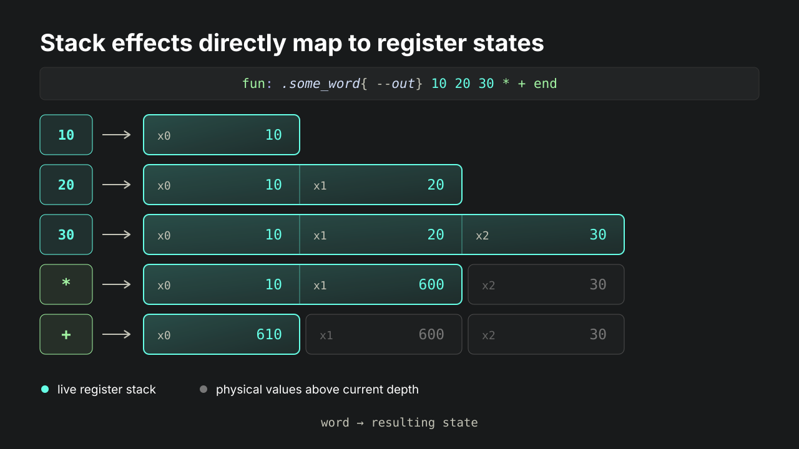


## Runtime/comptime split

- Runtime words operate on _entire_ register stack.
- Comptime words operate _anywhere_ in register stack; usually top.

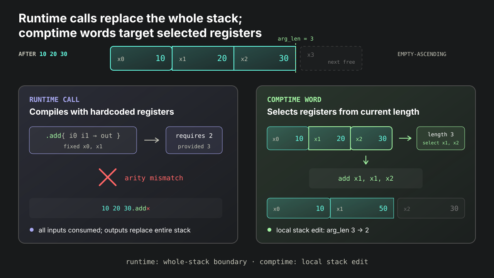


## Runtime call restrictions

Using _numbered_ registers as a stack requires runtime functions to assume _low-numbered_ registers. Calls consume and replace the whole stack.

```forth
\ Instruction requires specific register numbers:
\
\ add x0, x0, x1
fun: .add { i0 i1 -> i2 } [
  0b1_0_0_01011_00_0_00001_000000_00000_00000 .comp_out0
] end


\ Does not compile: wrong register numbering.
\ `20 30` would be in `x1 x2`, not in `x0 x1`.
fun: .some_word { -- out } 10 20 30 .add .add end


\ error: in `.some_word` (WORDLIST_EXEC):
\ unable to compile call to `.add`:
\ arity mismatch: required: 2, provided: 3
```


What we actually want:

```forth
fun: .some_word { -- out } 10 20 30 + + end
dis' .some_word
```

```asm
mov x0, #10
mov x1, #20
mov x2, #30
add x1, x1, x2 // locally-addressed registers
add x0, x0, x1
```

(My system actually folds this into one instruction; beside the point.)


## Comptime solution

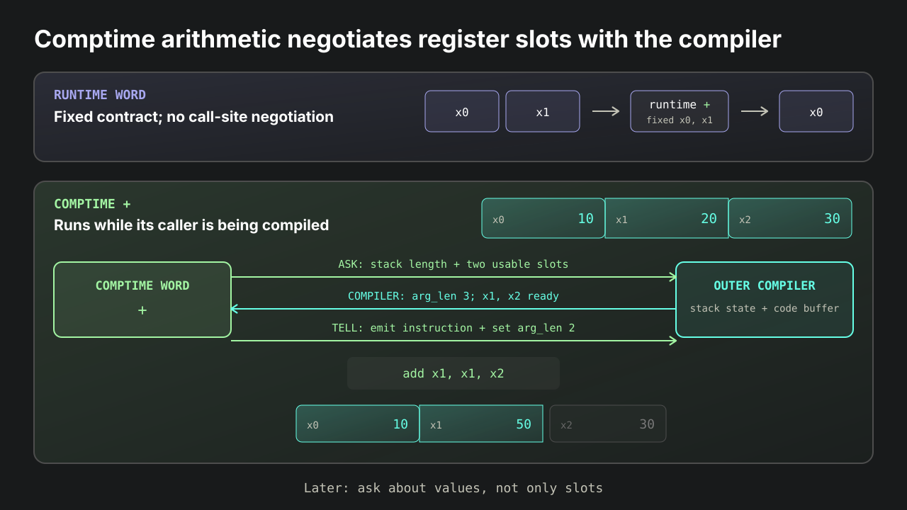

Partial solution: more comptime words which respect the register stack. They ask the interpreter about comptime stack length, and compile instructions on top registers.

Example: evolution of `+`: runtime -> comptime -> CF.

```forth
\ Early: runtime definition for bootstrap. Hardcoded low regs.

fun: + { i0 i1 -> i2 } [
  \ add x0, x0, x1
  0b1_0_0_01011_00_0_00001_000000_00000_00000 .comp_out0
] end


\ Later: "stack"-aware comptime definition. Uses top regs.

fun_comp: + { -- err }
  .comp_args2_regs { reg0 reg1 }          \ query stack length
  reg0 reg0 reg1 .asm_add_reg .comp_instr \ add Xd, Xn, Xm
  reg1 .comp_args_set                     \ reduce stack length
end
```


Another example: memory ops. This compiles, because `@ !` are comptime and respect top regs:

```forth
fun: .rot { adr0 adr1 adr2 }
  adr0 @ adr1 @ adr2 @ \ stack -- x0 x1 x2
  adr1 ! adr2 ! adr0 !
end
dis' .rot
```

```asm
mov x4, x0   // relocation
ldr x0, [x0] // adr0 @
mov x5, x1   // relocation
ldr x1, [x1] // adr1 @
mov x6, x2   // relocation
ldr x2, [x2] // adr2 @
mov x3, x5   // relocation
str x2, [x3] // adr1 !
mov x2, x6   // relocation
str x1, [x2] // adr2 !
mov x1, x4   // relocation
str x0, [x1] // adr0 !
ret
```

A smarter compiler would skip all these relocations. However, a simple stupid compiler gets you surprisingly far on performance, despite these defects.


How would comptime `@ !` be defined?

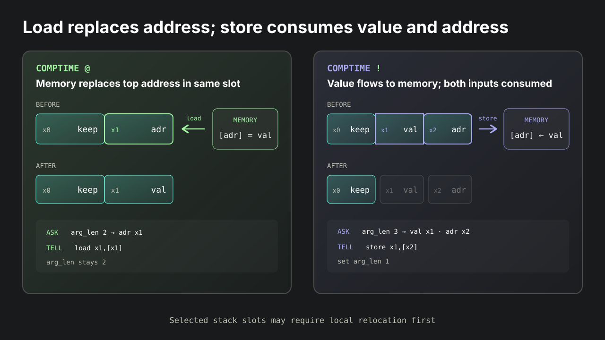

```forth
\ Runtime-only versions assume register numbers:

fun: @ { _adr -> val } [
  0 0 0 .asm_load_off .comp_out0 \ ldr x0, [x0]
] end

fun: ! { _val _adr } [
  0 1 0 .asm_store_off .comp_instr \ str x0, [x1]
] end


\ Comptime versions can respect register stack:

fun_comp: @ { -- err }
  1 nil .comp_args_min                \ validate arity
  .comp_args_get .dec { adr }         \ query stack length
  adr .comp_realloc_reg               \ relocate local if any
  adr adr 0 .asm_load_off .comp_instr \ ldr <adr>, [<adr>]
end

fun_comp: ! { -- err }
  2 nil .comp_args_min                 \ validate arity
  .comp_args_get .dec { adr }          \ query stack length
  adr .dec { val }                     \ figure out register numbers
  val adr 0 .asm_store_off .comp_instr \ str <val>, [<adr>]
  val .comp_args_set                   \ reduce stack length
end
```


People who design stack machine ISAs are probably feeling smug at this point. Dealing with register numbering causes compiler complexity.

...But comptime words do more than register numbering:
- Comptime arity validation.
- Peephole instruction fusion, without delegating to an outer compiler pipeline.


### Register stack and constant folding

Comptime stack and comptime words naturally lend themselves to peephole optimizations, most notably constant folding and instruction fusion, all inside the language, not inside the compiler.

This system uses single-pass assembly (with fixups). For each constant "push":
- Compiler immediately emits `mov` (or several, depending on size).
- Compiler records the constant in an internal abstract stack.
- Comptime words can inspect, detect, consume, backtrack.

```forth
10 20 30 40 + - *
```

```asm
mov x0, #-500
```

After the literals, two internal stacks evolve in parallel:

```
ABSTRACT STACK         EMITTED INSTR STACK
[10 20 30 40]          [x0=10][x1=20][x2=30][x3=40]
         +             rewind 2 · push [x2=70]
[10 20 70]             [x0=10][x1=20][x2=70]
      -                rewind 2 · push [x1=-50]
[10 -50]               [x0=10][x1=-50]
   *                   rewind 2 · push [x0=-500]
[-500]                 [x0=-500]
```

Legend: `[x2=70]` is state-shaped shorthand for `mov x2, #70`.

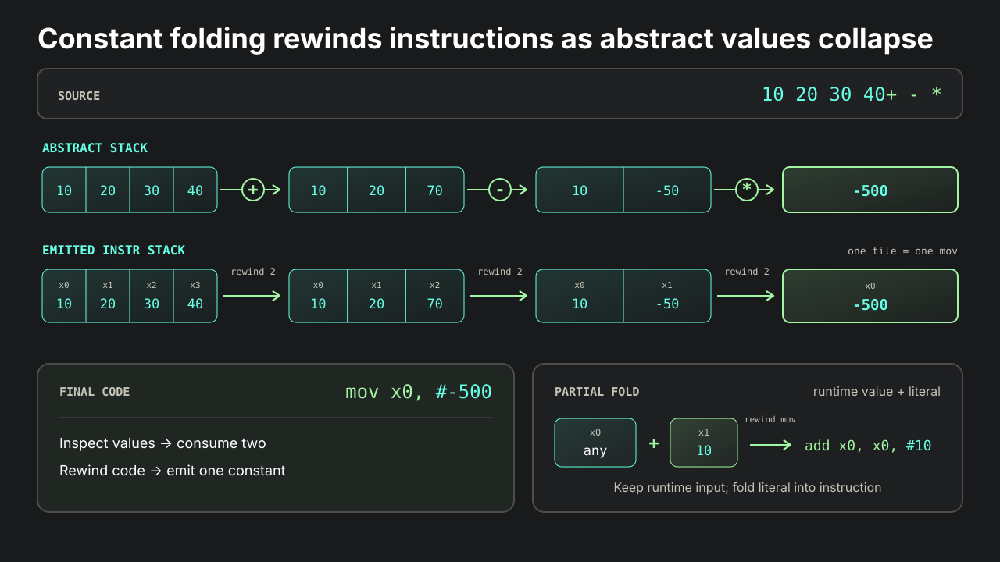

We do this by redefining comptime words to make them even smarter:

```forth
\ Full constant fold, or fallback.

fun_comp: + { -- err } [ .redefine ]
  .comp_pop2 .then + .comp_push \ fully folded
  else { -- } call'' + end      \ fallback
end


\ Full or partial constant fold, or fallback.

fun_comp: + { -- err } [ .redefine ]
  \ Full fold.
  .comp_pop2 .then + .comp_push .ret else { -- } end

  \ Partial fold or fallback.
  .comp_pop1 .then { imm }
    imm true .comp_addsub_imm .then .ret end
    imm .comp_push
  else { -- } end

  call'' +
end
```

Note how this optimization is not hidden inside some giant compiler codebase, as a pass over some giant IR. It's done _within the language_, on the fly, by simply inspecting and modifying the top of the comptime stack.

All arithmetic words in Astil Forth support full CF, and most support partial CF. More importantly, AF makes it easy to _define more_ in libraries or programs, without extending the compiler.

I think this demonstrates both the power of comptime execution and controlling the compiler, and the simplicity enabled by stacks.


## Param forwarding

For both technical and usability reasons, my system requires explicit parameter declarations. On function entry, params are "captured"; the register stack becomes "empty". Forwarding is manual:

```forth
fun: .add { one two -- three } one two + end
```

However, we can "push" params on entry, keeping the stack "full". The codegen is identical:

```forth
fun: .add { one two -> three } + end
```

Restores concatenative style in many cases, makes factoring easy; very little change from regular stack code. Egregious example:

```forth
\ Worse:
fun: str= { str0 len0 str1 len1 -- bool }
  str0 len0 str1 len1 .compare =0
end

\ Better:
fun: str= { str0 len0 str1 len1 -> bool } .compare =0 end
```


## Conditionals and loops

Comptime register stack is compatible with control structures. Astil Forth conditional expressions can "push" and "pop", just like you'd expect:

```forth
fun: .mock { cond -- A B }
  cond .then 10 20 else 30 40 end
end
false .mock .sc \ <2> 30 40
true  .mock .sc \ <2> 10 20


fun: .mock { cond -- out } [ .redefine ]
  10 20 30
  cond .then + - else * - end
end
false .mock .sc \ -590
true  .mock .sc \ -40
```



## Limitations

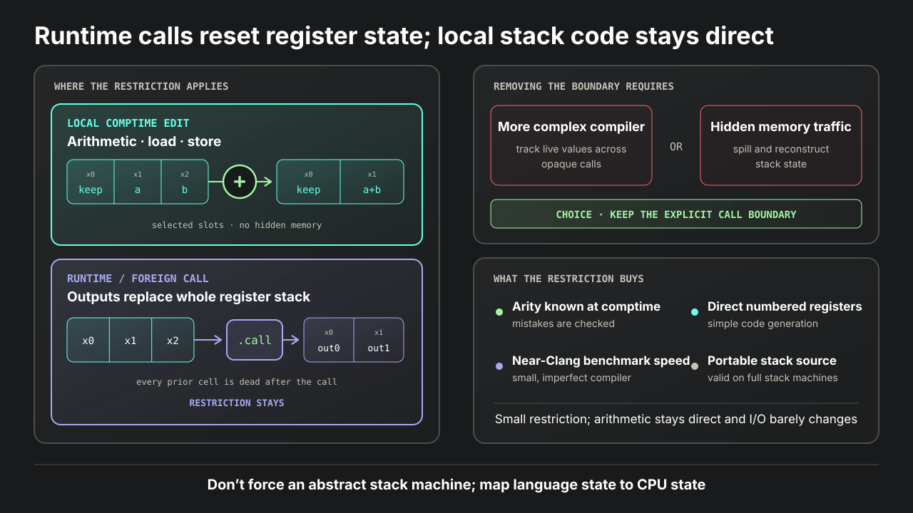

Runtime calls replacing register stack: restriction stays. This affects all user-defined runtime words, and all foreign calls.

Defeating this limitation requires either a much more complex compiler, or hidden memory ops. I choose neither.

Not a big deal. Arithmetic and load/store code is unaffected. IO code doesn't care.

See `bench/fnv1a64.af`. Uses stack-style arithmetic; runs at the same speed as C/Clang version.

See `examples/http_echo.af`. IO-heavy; true stack-code would look near-identical.


## Register stack lessons

- Marrying stack code _directly_ to numbered registers using a SIMPLE compiler is possible.
- Added internal complexity is real, but affordable.
- Tradeoffs in giving up concatenative code are minimal.
  - They make it possible to actually read the code back.
- Simple, defective codegen gets you **very close to Clang**, in a fraction of complexity and compilation time.
- The limitations force better diagnostics.
  - Arity must be known at comptime.
  - Arity mistakes are checked.


In a few thousand lines, our self-bootstrapping, self-assembling system approximates Clang and leading JIT engines in our benchmarks. See `bench/readme.md`.


Code written under the register-numbering restrictions remains "portable": valid for full stack machines. It's possible for one Forth dialect to target both.


Biggest takeaway: **don't force an abstract stack machine**. It fights the CPU and requires a complex compiler. Change the language to concretely map to what the CPU wants.


## Redesigning Forth syntax; readability; colors in plain ASCII

Stop overdoing punctuation! Use words:

```forth
\ Not this:
: some_word
  123 .
  234 ,
;

\ This:
fun: some_word
  123 .log_int
  234 .comp_instr
end
```


Important _semantic_ roles need distinct _syntactic_ roles.
Express them with general, extensible patterns:
- _Noun_ — value-like.
- _Verb_ — call-like.
- Suffix all declaring words.
- Suffix all parsing words.

```forth
some_value                 \ noun = value-like = C-style identifier
+ - @ ! s> u/mod .min .max \ verb = call-like  = non-identifier
declare: some_name         \ declaring word
parse' some_word           \ parsing word
```


These patterns enable good syntax higlighting. Use it!

```forth
fun: .run { -- err }
  " 2345"                  { port }
  128                      { backlog }
  instr' .handle_conn      { handler }
  port backlog .net_listen { sock }

  " [srv] listening on http://localhost:%s\n" port .elogf
  sock handler .net_accept_loop_threaded
end
```

- Names carry semantic signals.
- **No change** to compiler or execution model.
- Pure renaming + syntax higlighting → tremendously better UX.



## Outro

This talk and illustrations are in the repository:

https://github.com/mitranim/astil_forth

Info and contacts: https://mitranim.com

Ping me up on Discord or Telegram!
