# Rethinking error handling; its influence on memory management

- Reinventing error handling by learning from many languages.
- Making error-value-passing truly ergonomic.
- How errors influence language design and memory management.
- Avoiding core mistakes in errors and MM.


Error handling and memory management are closely related. I ended up adding structured MM support _because_ I wanted informative errors, which need dynamic memory.

All illustrations except Yoda are bot-generated.

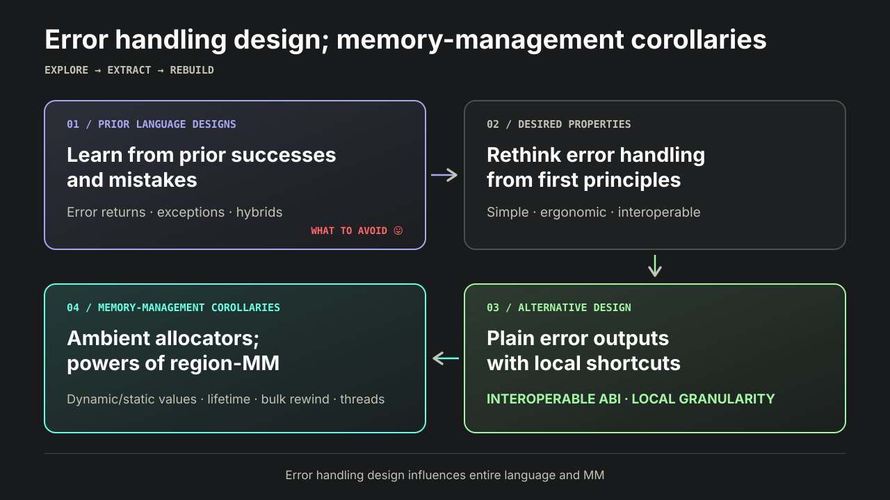


## Intro

About me: https://mitranim.com.

This talk is in the context of the language I call Astil Forth, which I'm using to explore language design from first principles. Repo: https://github.com/mitranim/astil_forth.

Prior talks:
- 2026-Jan: intro, self-assembly showcase, demos — https://www.youtube.com/watch?v=_4U1BR1U_oM
- 2026-Feb: register stack basics; transparent ABI interop — https://www.youtube.com/watch?v=rCF7wAB2wFQ
- 2026-Apr: turning JIT compilation into AOT compilation — https://www.youtube.com/watch?v=vkJJhURJt78
- 2026-Jul: redesigning Forth for register-addressing CPUs and for humans — https://www.youtube.com/watch?v=vNX6nzsgeuY

Target audience: all programmers, but especially language and compiler authors.


## Why

Never really liked error handling in languages I've used.

Languages can do better; below, we're going to demonstrate [how](#astil-forth-solution).


## Talk structure

- Explore error handling in prior languages; showcase problems.
- Explore many problems with exceptions.
- Explore desired properties of error handling.
- Explore alternative design implemented in Astil Forth.
- Explore effects of errors on memory management.


## Error handling in prior languages


C/Unix is still dominated by the worst error pattern I've ever seen:

```c
if (some_func() == -1) {
  int code = errno;
  // WTF: side-loading; still only integers; still no message!
}

// SOMETIMES it's ANY non-zero:
if (some_func()) {
  int code = errno;
}
```

Side note: the ABI of `int -1` is also inconsistent. Sometimes `libc` returns 64-bit `-1` as 64 1-bits; I've observed it forwarding that straight from the kernel (on XNU). More often: only lower 32 1-bits, requiring sign extension. Atrocious.


Zig: internal error-value unions:
- No public ABI.
- Limited to built-in enum `error{}`.
- Non-extensible: language constructs are incompatible with custom errors.

```zig
fn inner() !SomeType {
  return error.SomeError;
  return SomeType{};
}

fn outer() !void {
  // `try` works only with `error!value`.
  const val = try inner();
}

// Emulating multiple returns requires awkward struct wrappers.
// Language constructs like `try` are incompatible with that.
fn inner() struct { Val, Err } { return .{ {}, {} } }
```


Rust:
- Good: errors-as-values: arbitrary errors in `Result<T, E>`, and has local shortcut `?` for early return.
- Bad: unions have no public ABI; panics + unwinder; many ways to abort the program.

```rust
Result<T, E> // arbitrary error; `?` return; no public ABI
panic!()     // unwind + abort
assert!()    // panic + abort
.unwrap()    // panic + abort
```


Swift:
- Good:
  - Errors are part of function signatures.
  - Errors are passed locally.
  - No stack unwinder.
- Bad:
  - Weird ABI: dedicated register for errors.
  - Keyword soup of `try throw catch` aping exception-based languages.
  - Has _neither_ the advantage of exceptions, which is making errors invisible in the happy path, _nor_ the advantage of treating errors as plain values. One of the worst tradeoffs I've seen in error design.
  - Memory allocation failure aborts instead of returning an error.

```swift
extension String: @retroactive Error {}

func failable() throws -> Int {
  throw "some_err"
  return 123
}

try failable()
```


Go pretends to pass errors as values, but actually has exceptions:

```go
func fakeNeverPanics() (string, error) {
  panic("failure")
}

func main() { fmt.Println(fakeNeverPanics()) }

// panic: failure
// exit status 2

var staticErr = fmt.Errorf(`some_err`)

func actuallyNeverPanics() (string, error) {
  return "some_value", staticErr
}
```

Go stdlib documents many panics.

Side note. Anyone using Go should use _only_ exceptions; this drastically shortens code and makes it more robust. Having exceptions but checking only error returns is total nonsense because it makes control flow non-total. A robust program must handle all possible error modes.


Exceptions make all code untrustworthy:

```js
function alwaysSuccess() {return new MyObject()}
alwaysSuccess()
// uncaught RangeError: Out of memory
```


Java's `throws` annotation makes exceptions _even worse_ by lying:

```java
// Lying by omission:
void alwaysSuccess() {throw new RuntimeException();}
alwaysSuccess();
// Exception in thread "main" java.lang.RuntimeException


// Lying about exception type:
void alwaysHasMemory() throws IOException {throw new OutOfMemoryError();}
try {alwaysHasMemory();} catch (IOException err) {}
// Exception in thread "main" java.lang.OutOfMemoryError
```


Standard Forth: exceptions make stack effects inconsistent:

```fs
\ Division may throw, preventing another push:
: calc ( qty -- price shipping )
  123 swap /
  234
;

: try_calc ( qty -- price shipping ok? )
  ['] calc catch 0=
;

clearstack 3 try_calc .s cr \ <3> 41 234 -1
clearstack 0 try_calc .s cr \ <2> 123 0
```


In my opinion, all of these are fatally flawed.


## More problems with exceptions

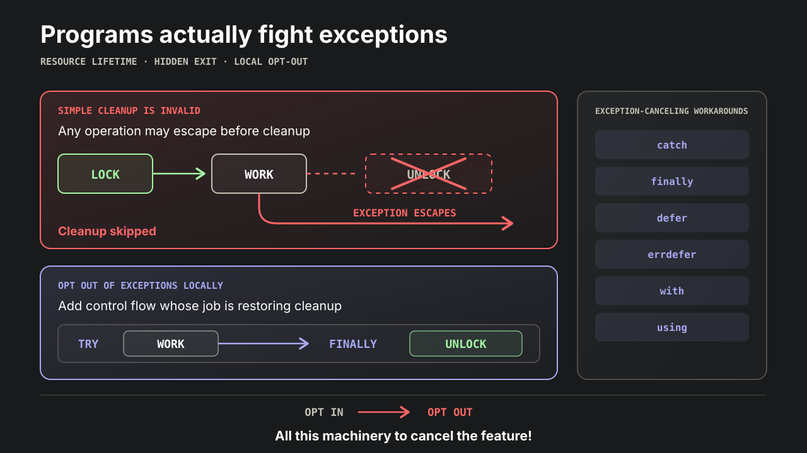

Exceptions make errors 100% invisible in the happy path. The higher-level your code, the better this gets. In lower-level or mission-critical code, this is bad.

The following simple, clear code is _invalid_ in languages with exceptions:

```
mutex.lock()
work()
mutex.unlock()


file = open()
work()
file.close()
```

Whenever a language _opts into_ exceptions, it has to provide multiple ways of _opting out_. Languages with exceptions end up adding control flow constructs which _fight_ exceptions, trying to cancel them:

```
mutex.lock()
try:
  work()
finally:
  mutex.unlock()
```

Exceptions were supposed to make all code clearer, but actually have the opposite effect when resource management is involved!


But wait, there's more!

They've invented more, _more_ ways of getting around exceptions, sometimes by adding more non-local execution, solving old poison with new poison, while adding complexity:

```
mutex.lock()
defer mutex.unlock()  -- executed non-locally
work()


mem = alloc()
errdefer mem.free()   -- if `init()` "fails"
init()
return mem


with mutex:
  work()

# Equivalent to the following:
# mutex.__enter__()
# try:
#   work()
# finally:
#   mutex.__exit__()


using file = open()   -- closed at end of scope; non-local execution
work()
```

To be clear, I like `defer` as user, and dislike as compiler author. It adds complexity at several levels.

Bonanza: `catch finally defer errdefer with using` and more. All in the same class: exception-canceling workarounds.

Flawed idea. All this design and implementation work; then programmer has to opt-out, via constructs which require yet more work. Instead of opt-in + opt-out, design for _just_ opt-in, into local error forwarding via shortcuts.


Important nuance: there are also hardware/OS exceptions, like trying to load/store inaccessible memory. Languages with exceptions have an advantage here: they can convert interrupts/signals to language exceptions. Languages without exceptions have no channel for this.


## Desired properties

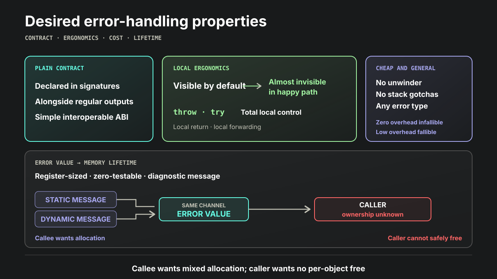

Desired properties of error handling:
- Errors are declared in function signatures, and returned _alongside_ regular outputs.
- _Simple_ ABI; interoperable between languages.
- Errors are visible by default.
- Easily made _almost_ invisible in the happy path.
- Easily _locally_ returned with `throw`.
- Easily _locally_ forwarded with `try`.
- Callers have local _total_ control.
- No exception machinery; no stack unwinder.
- Zero overhead in infallible paths.
- Low overhead in fallible paths.
- No restriction on error types.
- No stack depth gotchas in Forth.

Ergonomic error handling and partial failure states _demand_ multiple outputs. Single-output is a _tragic_ defect of C; it's extremely unfortunate how many other languages have inherited this defect.


Desired properties of an error value:
- _Simple_ ABI; interoperable between languages.
- Fits into a register.
- Cheaply testable for zero/non-zero.
- Carries diagnostic message.
- Call trace is available somewhere.
- Messages can be statically allocated.
- Cheap to create dynamically.
- Can use custom error structures.
- Callers don't have to deallocate errors.

Obvious options for error values:
- Integer codes:
  - Cheapest.
  - Good for checking specific conditions.
  - Non-informative.
- C-strings:
  - Can be informative.
  - Static = as cheap as integers.
  - Dynamic = requires ambient allocator.
- Anything else:
  - Also needs ambient allocator.
  - Complicates contract.


Notable conflict / mismatch:
- Callee often wants to allocate.
- Callee often wants to mix dynamic and static allocation.
- Caller does _not_ want to deallocate:
  - A returned error may be either statically or dynamically allocated.
  - Caller often doesn't know which.
  - Per-object "free" is a pain in general; you don't want that.


## Astil Forth solution

Having looked at all that, here's what I suggest:
- Functions have multiple outputs; error is last.
- Errors are visible by default.
- Local shortcuts `throw try`.
- Opt-in local auto-"try".
- `nil` error return is implicit.


```forth
fun: .partial_fail { -- val err }
  123              \ val
  " error_message" \ err
end

fun: .total_handler { -- val }
  .partial_fail { val err }
  " [debug] error: %s\n" err .elogf
  val
end

\ Last output `Err` enables local `try`:
fun: .unhappy { -- val Err }
  .partial_fail .try { val }
  .partial_fail .try { val }
  .partial_fail .try { val }
  val
end

\ Last output `err` enables local auto-"try".
\ Eliminates dramatic amounts of noise.
fun: .happy { -- val err }
  .partial_fail { val }
  .partial_fail { val }
  .partial_fail { val }
  val
end

fun: .total_fail { -- val err }
  " error_message" .throw \ Return error; `val` is undefined.
  123 \ Return value + nil error.
end
```

With this design, errors remain plain outputs, always in signatures and with a simple ABI, keeping callers in total control, while keeping "happy" code completely free of error-handling and error-returning noise. I can't overstate how nice this is.

This has _local granularity_. Code can _locally_ choose how much it cares about errors.



Local auto-try doesn't affect callers. They still see the error:

```forth
fun: .always_fail { -- err } " some_err" end
fun: .never_fail { -- ok? } .always_fail =0 end
```

Note that because this system uses numbered registers as its "stack", it's impossible to have "wrong stack depth" in case of error. However, values in non-error output registers may be undefined in case of error. Each function decides its own contract.


Importantly, we _don't need "catch"_. It would be completely superfluous. If you were going to "catch", simply skip "try".

In practice, code which cares about errors also deals with resources, and needs to handle every error anyway. Avoiding "try" also gives confidence: you see _one_ error, you see _all_ errors.

Note again how we avoid opting-in then opting-out. Simply don't opt-in.


_Do try_ the song:

[](https://www.youtube.com/watch?v=6n915Y2E8UA)


Assertions return errors; can be handled; no hidden abort. We can afford this because our handling is ergonomic:

```forth
fun: .inner { A B -- Err }
  assert= A B end
end

fun: .outer
  123 234 .inner { err }
  " [outer] %s\n" err .elogf
end

.outer
```


Disclaimer: Astil Forth doesn't support call traces. Mostly because I haven't decided where to put them. In a typed language, you'd define an error interface and associate traces with error structures. In an untyped language, C-string errors are extremely natural, so traces would probably need a side channel.


Aside from lack of traces, I prefer AF error handling over other languages'. I'd like more language designers and compiler writers to consider it.


## Comparison with Odin

Quick shoutout to Bill Ginger's [Odin](https://odin-lang.org), whose error handling is close to Astil Forth: multi-outputs, clear ABI, `or_return` shortcut. Unfortunately, Odin lacks auto-"try", `throw`, or nil error insertion, so code remains noisy.

```odin
Error :: enum {None, Fail}

inner :: proc() -> (int, Error) {
  return 123, .Fail
  return 234, .None // No auto-nil.
}

outer :: proc() -> (int, Error) {
  val := inner() or_return // Like AF `try`.
  return val
}
```


## Static vs dynamic allocation

Lots of code gets away with static allocation. Returning inline C-strings as errors is beautifully simple:

```forth
fun: .static_error { -- err } " static_error_msg" end
.static_error .elog .elf

" some_text" cstr: SOME_ERR
SOME_ERR .elog .elf
```

But lots of code wants contextual diagnostics in error messages. Where does the memory come from?

```forth
fun: .dynamic_error { path -- err }
  " unable to read file at `%s`" path .errf
end

" /some/path" .dynamic_error .elog .elf
```

In a single-threaded system, you could use a static error buffer, or rotate buffers in a ring. This doesn't work in multi-threading.

An easy "solution" is to allocate and free _every_ error. But this is inconvenient, expensive, and mistake-prone:

```forth
fun: .inner { -- err }
  " some_error_msg" .strdup
end

fun: .outer
  .inner { err }
  err .elog .elf
  err .free
end
```



## Allocator interface

So we need ambient thread-safe allocation, without having to "free" individual objects.

Natural simplest solution:
- Per-thread memory arena.
- Bump-allocation; bulk "free".
- Memory is owned by caller / parent.
- Available anywhere via dedicated register or TLS.


We have to decide the allocator interface. This is where languages and libraries tend to overshoot, even in Forth. It turns out, the nicest allocator interface you can provide is a pair of addresses for remaining memory range: `[top,ceil)`, _without hiding_ them behind functions.

This simplest interface has powers not available in higher level allocators, such as querying entire remaining capacity. This automatically means fixed memory budget. That's fine in practice; just ask for enough memory upfront. Virtual memory for the win; operating systems page it in lazily, on demand. The program will use only the memory it actually touches.

In other words, we don't need a "resizable arena" abstraction on modern systems, because the OS already resizes our (virtialized) memory.


This also naturally restricts child threads to fixed memory budgets, which can be bad or good, depending on use case. For example, in servers, limited per-request memory budgets can be good. Note how auto-resizing allocators simply don't have this power; "unlimited" memory is a premature abstraction.


Now that we have an allocator interface, how to make it available? You don't want to pass it manually everywhere.

In Astil Forth, each thread has its own context object, which begins with an allocator interface, and the rest of its structure is arbitrary and program-defined. Register `x28` is dedicated to holding its address. This is actually similar to what Go does internally; they dedicate `x28` to the structure describing the current goroutine. However, in AF, this is a _public_ interface, and programs can define their own contexts.


Every context object begins with this header, which may be followed by program-defined fields:

```forth
struct: Ctx
  Adr 1 field: .Ctx_self
  Adr 1 field: .Ctx_top
  Adr 1 field: .Ctx_ceil
  \ ... arbitrary program-defined fields ...
end
```

On the main interpreter thread, this actually refers to the `Interp*` object, which begins with the `Ctx` header.


Available anywhere via `context`:

```forth
dis' context
\ mov x0, x28
\ ret


" current context object: " .log
context .show


context .Ctx_top  @ .show
context .Ctx_ceil @ .show
```


Can override context for a block of code:

```forth
fun: .outer_func { some_ctx }
  some_ctx .with_ctx
    .inner_func
  end
end
```


The resulting solution has significant similarities with traditional task-local `USER` structure in other Forths, but also significant differences; Astil Forth's context comes with an allocator interface, gives the program more control, and has a simple public ABI.




With ambient arena-style memory, we can _finally_ dynamically allocate. The absence of per-object "free" allows to freely mix dynamic and static values:

```forth
fun: .inner { path -- err }
  path .then
    " unable to open file `%s`" path .errf \ Dynamic memory.
  else
    " unable to open file: missing path"   \ Static memory.
  end
end

fun: .outer
  .ctx_top { top }

  nil       .inner .elog .elf
  " /path0" .inner .elog .elf
  " /path1" .inner .elog .elf

  top .ctx_top_set \ Bulk "free"; no effect on static memory.
end

.outer
```

The ability to mix dynamic and static values is enabled by choosing region-based allocation. The traditional `libc` interface `malloc/free` wouldn't let you do this, which I feel puts that interface into question.


Ordinary object allocation is easy:

```forth
struct: Some_obj
  Cell 1 field: .Some_obj_val
end

fun: .some_obj_new { val -- obj err }
  new' Some_obj { obj }
  val obj .Some_obj_val !
  obj
end
```

Typed, aligned bump-allocation through current ambient context.


This is probably the simplest MM approach. It also happens to be very fast. Idiomatic Astil Forth does extremely well in our allocator-heavy ["binary tree"](../../bench/readme.md) microbenchmark.


## Other powers of region MM

You can ask for _entire_ remaining capacity. Very handy for string formatting:

```forth
fun: .strf { ... -- str err }
  align' U8 .ctx_avail { buf cap }
  ...
  buf cap  ...  .vsnprintf  ...
  ...
end
```

Allocators of the style `malloc/free` don't have this power; they require the caller to declare size upfront.

Small but meaningful indicator that simple interfaces have special powers, and premature abstractions can lose them.


## Memory lifetime in threading

Memory lifetime and usage rights can be a little tricky. By default, only one thread at a time should be using a memory region.

- Parent allocates context memory.
- Spawn transfers usage rights to child.
- Child memory survives death of child thread.
- Successful join returns usage rights back to parent.


```forth
use' lang.af
use' pthread.af

fun: .child { inp -- out }
  " dynamically formatted: %zd" inp .errf
end

fun: .parent { -- Err }
  CTX_CAP Ctx .ctx_mem_map .try { ctx }
  instr' .child 123 ctx .thread_spawn_ctx { thread err }

  err =0 .then
    thread .thread_join { out err }
  end

  err .then
    " error: %s\n" err .elogf
  else
    " output: %s\n" out .elogf
  end

  ctx .ctx_mem_unmap
end

.parent  \ error: unable to open file `/some/path`
```

Child thread happily dynamically allocates, we _still_ don't have to worry about per-object "free", and have very high allocation throughput.


## Comparison with GC

Depending on the program, this allocator style can be almost as easy as programming with GC, but _without GC_, its complexity, and its overheads. GC is an intractable problem; they'll never stop solving it. Go just underwent a redesign of its garbage collector. Nim is undergoing yet another redesign of its memory system.

Meanwhile, for many types of programs, all we really needed was `[top,ceil)` and we're done. I think that's worth a lot.



## Memory allocation errors

Many supposedly "systems" languages treat allocation failure as fatal. With highly ergonomic error handling, we can mix and match. Happy code uses auto-"try"; unhappy code handles allocation failures:

```forth
fun: .happy { -- err } \ Enable local auto-"try".
  new' Some_obj { obj }
  " [happy] allocated: %p\n" obj .elogf
end
.happy


fun: .grumpy { -- Err } \ Enable local `.try`.
  new' Some_obj .try { obj }
  " [grumpy] allocated: %p\n" obj .elogf
end
.grumpy


fun: .unhappy
  new' Some_obj { obj err }
  err .then
    " [unhappy] unable to allocate: %s\n" err .elogf
  else
    " [unhappy] allocated: %p\n" obj .elogf
  end
end
.unhappy
```

Error handling design ends up influencing program semantics!

I feel that's an important takeaway for language design.


## Outro

Too much talk about memory. TLDR and takeaway:
- Error handling design can be _significantly_ improved over the status quo.
- It ends up influencing the rest of the language and program semantics in unexpected ways.



This talk and illustrations are in the repository:

https://github.com/mitranim/astil_forth

Info and contacts: https://mitranim.com

Ping me up on Discord or Telegram!
